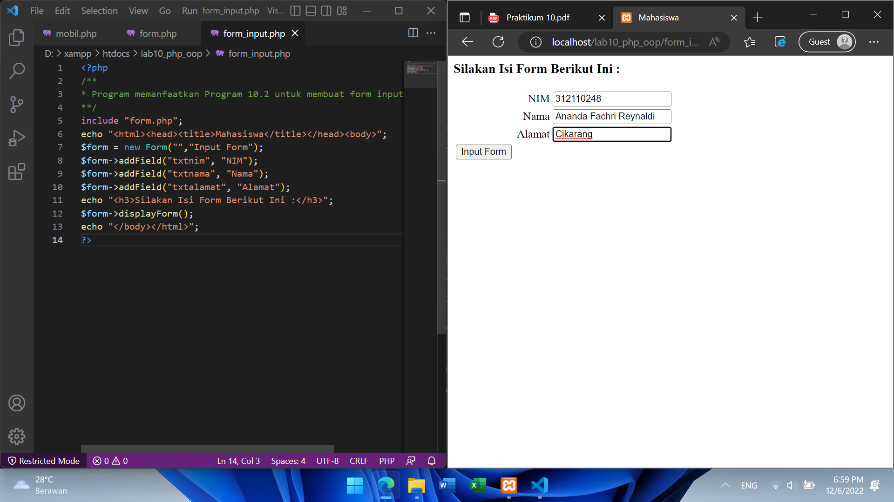

# Lab10Web
## Ananda Fachri Reynaldi
## 312110248
## TI.21.B1
<br>
<b>XAMPP</b>

Buka XAMPP Control Lalu Klik `Start` untuk menjalankan MySQL Server. Pastikan web server Apache dan MySQL Server sudah dijalankan.
<br>

Membuat Folder `lab10_php_oop` pada root directory web server (d:\xampp\htdocs)
<br>

Membuat File `mobil.php`
Setelah itu uji coba gunakan URL :
```
http://localhost/lab10_php_oop/mobil.php
```
<br>

Membuat File `form.php`
<br>

Membuat File `form_input.php`
<br>